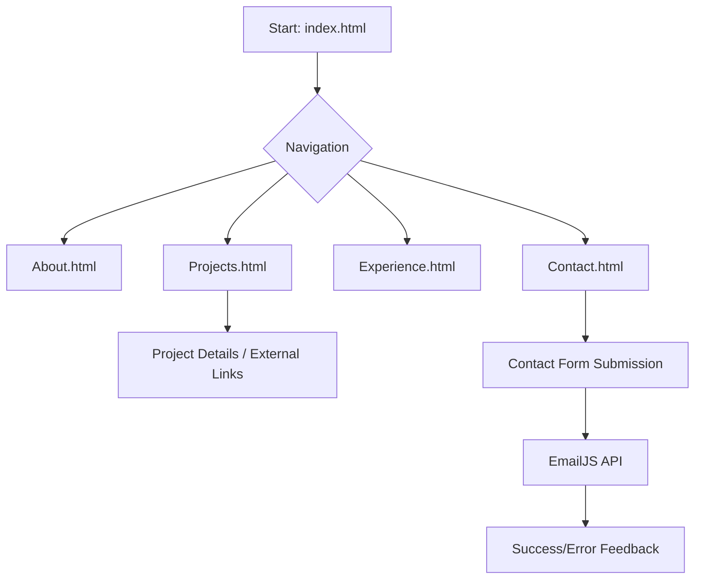

# Assignment: Design a Personal Portfolio Page
**Course: Full Stack Development Laboratory**

---

## 1. Title
**Design a Personal Portfolio Page using HTML and CSS. Use Bootstrap CDN if required.**

---

## 2. Objectives
1.  **Understand Web Methodologies**: Learnt the structured approach to developing modern web applications.
2.  **Frontend Mastery**: Familiarized with core frontend technologies (HTML5, CSS3, JavaScript) and frameworks (Bootstrap).
3.  **Responsive Design**: Designed interfaces that adapt to different screen sizes (Mobile, Tablet, Desktop).

---

## 3. Problem Statement
**Designed and developed** a professional Personal Portfolio website that serves as a digital resume. The website **includes** sections like Home (Hero), About Me, Experience, Projects, and Contact. It **is** aesthetically pleasing, uses modern typography, and provides a seamless navigation experience across all devices.

## 4. Theory

### A. HTML (HyperText Markup Language)
HTML is the standard markup language for creating web pages. It describes the structure of a web page semantically.

*   **Syntax**: HTML uses "tags" enclosed in angle brackets. Most tags have an opening `<html>` and a closing `</html>` part.
*   **Basic Structure**:
    ```html
    <!DOCTYPE html>
    <html>
    <head>
        <title>Page Title</title>
    </head>
    <body>
        <h1>This is a Heading</h1>
        <p>This is a paragraph.</p>
    </body>
    </html>
    ```
*   **Important Tags**:
    *   `<div>`: A container for flow content.
    *   `<a>`: Hyperlinks for navigation.
    *   ``: For embedding images.
    *   `<section>`: Represents a standalone section of a document.

### B. CSS (Cascading Style Sheets)
CSS is used to style and layout web pages — for example, to alter the font, color, size, and spacing of your content.

*   **Syntax**: CSS consists of a selector and a declaration block.
    ```css
    selector {
        property: value;
    }
    ```
*   **The Box Model**: Every element in CSS is a rectangular box. It consists of:
    *   **Content**: The actual text or image.
    *   **Padding**: Transparent area around the content (inside the border).
    *   **Border**: A border that goes around the padding and content.
    *   **Margin**: Transparent area outside the border.

*   **Modern Layouts (Flexbox & Grid)**:
    *   **Flexbox**: Designed for one-dimensional layouts (rows OR columns).
        *   *Syntax*: `display: flex; justify-content: space-between; align-items: center;`
    *   **CSS Grid**: Designed for two-dimensional layouts (rows AND columns).
        *   *Syntax*: `display: grid; grid-template-columns: repeat(3, 1fr); gap: 20px;`

### C. Responsive Web Design (RWD)
RWD is an approach to web design that makes web pages render well on a variety of devices and window or screen sizes.

*   **Media Queries**: Used to apply different styles for different media types/devices.
*   **Syntax**:
    ```css
    @media (max-width: 768px) {
      .navbar nav {
        flex-direction: column;
        display: none; /* Hide for mobile toggle */
      }
    }
    ```
*   **Viewport Meta Tag**: Essential for responsive sites.
    ```html
    <meta name="viewport" content="width=device-width, initial-scale=1.0">
    ```

### D. Bootstrap & CDN
Bootstrap is the world’s most popular frontend open-source toolkit. It features Sass variables and mixins, a responsive grid system, and extensive prebuilt components.

*   **What is a CDN?**: A Content Delivery Network (CDN) is a system of distributed servers that deliver web content to a user based on their geographic location.
*   **How to call Bootstrap CDN**:
    ```html
    <link href="https://cdn.jsdelivr.net/npm/bootstrap@5.3.0/dist/css/bootstrap.min.css" rel="stylesheet">
    ```
*   **Benefits**: High availability, faster performance, and caching.

### E. JavaScript (Advanced Interactivity)
JavaScript allows you to implement complex features on web pages.

*   **DOM Manipulation**: The Document Object Model (DOM) is a programming interface for web documents. JS can change HTML elements, attributes, and CSS styles.
    *   *Example*: `document.getElementById('id').innerHTML = 'New Text';`
*   **Event Listeners**: Allows the script to wait for user interaction.
    ```javascript
    element.addEventListener('click', () => {
        console.log('Clicked!');
    });
    ```
*   **Intersection Observer API**: Used to detect when an element enters the viewport (useful for scroll animations).
    ```javascript
    const observer = new IntersectionObserver((entries) => {
        entries.forEach(entry => {
            if (entry.isIntersecting) entry.target.classList.add('visible');
        });
    });
    ```
*   **Async/Await**: Used for handling asynchronous operations like API calls (e.g., sending email via EmailJS).
    ```javascript
    async function sendData() {
        const response = await fetch(url);
        const data = await response.json();
    }
    ```

### F. External Libraries & Assets
1.  **Google Fonts**: Used for modern typography.
    *   *Calling*: `<link href="https://fonts.googleapis.com/css2?family=Inter:wght@400;700&display=swap" rel="stylesheet">`
2.  **Font Awesome**: Provides a massive set of vector icons and social logos.
    *   *Usage*: `<i class="fab fa-github"></i>`
3.  **EmailJS**: Allows sending emails directly from JavaScript without a backend server.

---

## 7. Component-Wise Technical Implementation

### I. Home (Hero Section)
- **Technical Highlight**: Dynamic Typing Animation.
- **Implementation**: A JavaScript array of strings **was** iterated over. The `substring()` method **was used** to selectively display characters, creating a 'typing' and 'deleting' visual effect.
- **CSS**: Uses a full-height (`100vh`) flex container with a background gradient.

### II. About & Skills Section
- **Technical Highlight**: Interactive Skill Cards.
- **Implementation**: **Used** `display: grid` to organize skill items. Hover effects **were implemented** using CSS `transform: translateY(-10px)` and `scale(1.05)` for a premium feel.
- **Tooltips**: Custom tooltips **were created** using the `data-tooltip` attribute and CSS pseudo-elements (`::before` and `::after`).

### III. Experience Timeline
- **Technical Highlight**: Vertical Progress Line.
- **Implementation**: A central line **was created** using a single `div` or a border on the container. Each "Experience Card" **was positioned** relative to this line with circular markers (dots) positioned absolutely.
- **Responsive Handling**: On smaller screens, the timeline shifts from a two-column layout to a single vertical column.

### IV. Projects Grid
- **Technical Highlight**: Responsive Card Layout.
- **Implementation**: Bootstrap’s grid system (`col-md-6`, `col-lg-4`) or CSS Grid (**used**) ensuring cards wrap naturally.
- **Accessibility**: Every project link **includes** an `aria-label` for screen reader compatibility.

### V. Contact Form
- **Technical Highlight**: Client-Side Email Handling.
- **Implementation**: Instead of a traditional PHP/Node.js backend, this project **uses** the **EmailJS SDK**.
- **UX**: A spinner icon and status messages (Success/Error) provide real-time feedback to the user without reloading the page.

---

## 8. Design & Execution Steps
1.  **Layout Planning**: **Defined** the visual hierarchy and structure.
2.  **HTML5 Coding**: **Used** semantic tags like `<header>`, `<nav>`, `<main>`, `<section>`, and `<footer>` for better SEO.
3.  **CSS Development**:
    *   **Set** global variables (colors, fonts).
    *   **Implemented** a mobile-first responsive strategy.
    *   **Used** Flexbox for the navbar and Hero section.
4.  **JavaScript Implementation**:
    *   **Wrote** a custom typing script using `setInterval` or `setTimeout`.
    *   **Implemented** a hamburger menu for mobile devices.
    *   **Added** "Scroll-to-Reveal" animations using Intersection Observer.
5.  **Integration**: **Combined** local styles with Bootstrap components where needed.
6.  **Deployment/Testing**: **Validated** forms and responsive breakpoints.

---

## 9. Flowchart of the Application


---

## 10. Test Cases
1.  **Navigation Accuracy**: **Ensured** the `active` class shifts correctly between pages.
2.  **Mobile Menu Functionality**: The hamburger icon **toggled** the menu visibility correctly on screens < 768px.
3.  **Form Validation**: Required fields in the contact form **showed** an error if empty.
4.  **Animation Timing**: Scroll animations **triggered** exactly when 10% of the element was visible.
5.  **CDN Fallback**: **Tested** and verified that the site remains functional even if a CDN resource is blocked.

---

## 11. Conclusion
**Built** a Personal Portfolio as a comprehensive exercise in frontend development. It **combined** structural HTML, aesthetic CSS, responsive Bootstrap grids, and interactive JavaScript. Mastering these technologies **allowed** for the creation of professional, fast-loading, and user-friendly web applications.

---
**Date of Performance:** ______________
**Date of Completion:** ______________
**Faculty Sign:** ______________
**Grade/Marks:** ______________
