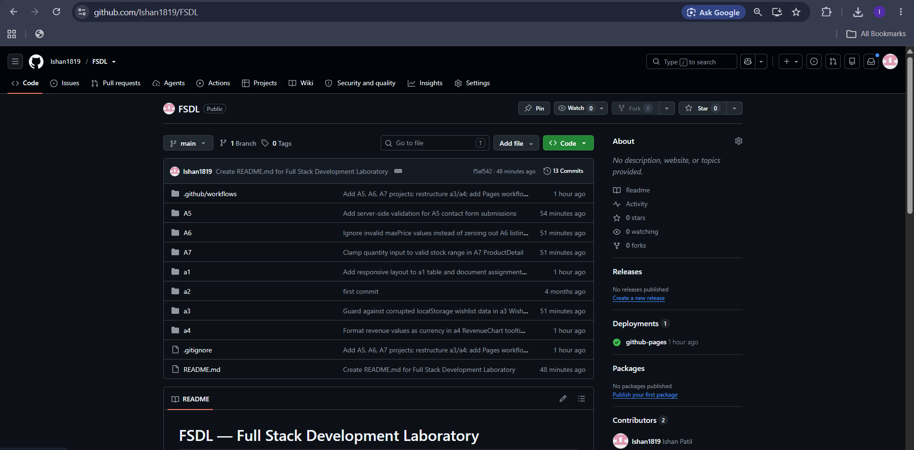
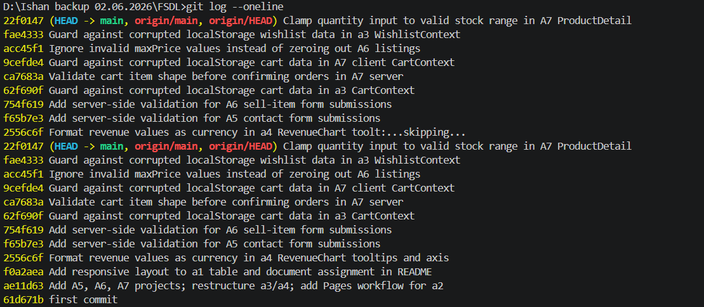
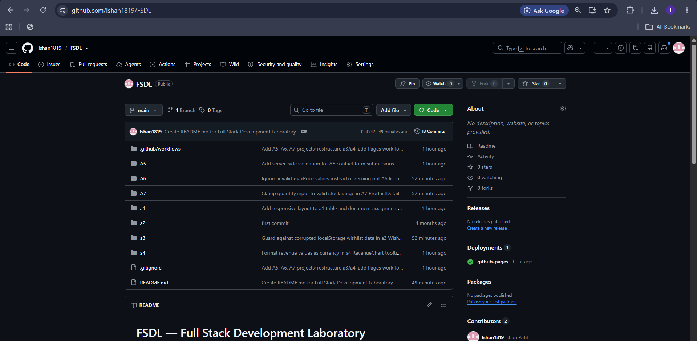
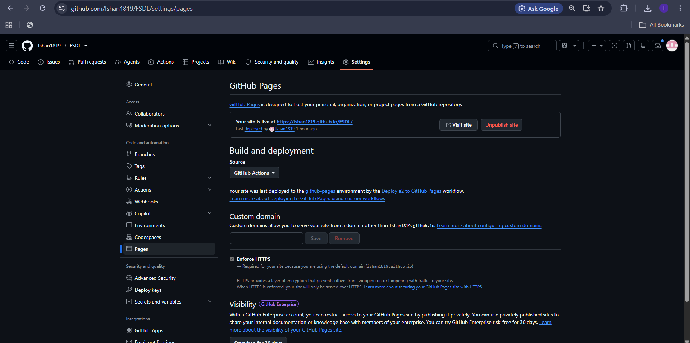
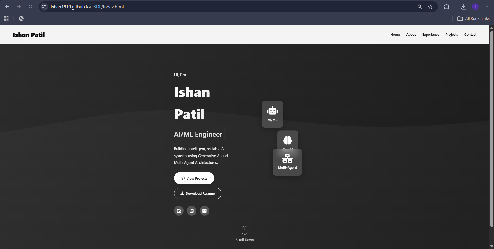

# Proof of Implementation — FSDL

## Student Details

| Field | Value |
|-------|-------|
| Name | Ishan Pravin Patil |
| Roll No / PRN | 123B1B021 |
| Class | BTech Final Year |
| Division | A |
| Subject | DevOps (FSDL) |

## Repository Link
https://github.com/Ishan1819/FSDL

## Hosted Website Link
https://ishan1819.github.io/FSDL/

---

## 1. Git Setup Proof

### `git --version`
```
git version 2.54.0.windows.1
```


### `git config --global --list`
```
user.email=ishanp141@gmail.com
user.name=Ishan1819
```


---

## 2. Folder Structure Proof

```
FSDL/
  README.md
  proof.md
  screenshots/                 (repo-wide proof screenshots)
  .github/workflows/           CI/CD (GitHub Pages deployment for a2)
  a1/
    README.md
    table.html
    output-screenshots/
  a2/
    README.md
    index.html, about.html, experience.html, projects.html, contact.html
    css/, js/, assets/
    output-screenshots/
  a3/
    README.md
    src/ (components, context, data)
    output-screenshots/
  a4/
    README.md
    src/ (components)
    output-screenshots/
  A5/
    README.md
    server.js, data/, views/, public/
    output-screenshots/
  A6/
    README.md
    server.js, data/, views/, public/
    output-screenshots/
  A7/
    README.md
    client/  (React + Vite frontend)
    server/  (Express REST API backend)
    output-screenshots/
```

---

## 3. Repository Home Page Proof




---

## 4. Commit History Proof (minimum 5 meaningful commits)

```
22f0147 Clamp quantity input to valid stock range in A7 ProductDetail
fae4333 Guard against corrupted localStorage wishlist data in a3 WishlistContext
acc45f1 Ignore invalid maxPrice values instead of zeroing out A6 listings
9cefde4 Guard against corrupted localStorage cart data in A7 client CartContext
ca7683a Validate cart item shape before confirming orders in A7 server
62f690f Guard against corrupted localStorage cart data in a3 CartContext
754f619 Add server-side validation for A6 sell-item form submissions
f65b7e3 Add server-side validation for A5 contact form submissions
2556c6f Format revenue values as currency in a4 RevenueChart tooltips and axis
f0a2aea Add responsive layout to a1 table and document assignment in README
ae11d63 Add A5, A6, A7 projects; restructure a3/a4; add Pages workflow for a2
61d671b first commit
```
Total: 12+ commits (minimum 5 required).



---

## 5. Assignment Folders Visible Proof

All seven assignment folders are present at the repository root: `a1`, `a2`, `a3`, `a4`, `A5`, `A6`, `A7`.



---

## 6. GitHub Pages Settings Proof

- Source: GitHub Actions (`.github/workflows/deploy-pages.yml`)
- Trigger: push to `main` touching `a2/**`, or manual `workflow_dispatch`
- Deployed folder: `a2/`
- Confirmed live at: https://ishan1819.github.io/FSDL/



---

## 7. Live Site Proof

Live URL: https://ishan1819.github.io/FSDL/



---

## 8. Proof Checklist Summary

| No. | Proof Required | Status |
|---|---|---|
| 1 | git --version screenshot | Added |
| 2 | git config --global --list screenshot | Added |
| 3 | Repository folder structure | Added (text) |
| 4 | Public GitHub repository page | Added |
| 5 | Commit history (5+ commits) | Added |
| 6 | Assignment folders visible | Added |
| 7 | GitHub Pages settings page | Added |
| 8 | Live hosted profile website | Added |
| 9 | README with repo link and hosted link | Added |

## Assignments Summary

| # | Folder | Title | Stack |
|---|--------|-------|-------|
| 1 | a1 | HTML Text Formatting Tags | HTML, CSS |
| 2 | a2 | Personal Portfolio Page | HTML, CSS, JS |
| 3 | a3 | Jucci - E-commerce React App | React, Context API |
| 4 | a4 | E-commerce Analytics Dashboard | React, Chart.js |
| 5 | A5 | Wanderly Travels - Travel Agency Website | Node.js, Express, EJS |
| 6 | A6 | Used Marketplace - Online Classifieds Website | Node.js, Express, EJS |
| 7 | A7 | Full-Stack E-commerce App | React (Vite) + Express REST API |

## Assignment Details

### a1 - HTML Text Formatting Tags
- Aim: Demonstrate HTML text formatting tags (b, strong, i, em, mark, small, del, ins, sub, sup, u, pre, q, code, abbr, kbd) inside a styled table.
- Technologies: HTML, CSS (inline style).
- File: a1/table.html
- Output: Open table.html in a browser to view the styled table with live tag examples.

### a2 - Personal Portfolio Page
- Aim: Design a professional personal portfolio website (digital resume) with Home, About, Experience, Projects, and Contact sections.
- Technologies: HTML5, CSS3, JavaScript (ES6+), Bootstrap CDN, Font Awesome, Google Fonts, EmailJS.
- Features: typing animation on hero section, scroll-reveal animations via Intersection Observer, responsive mobile navigation, contact form handled client-side via EmailJS.
- Deployment: auto-deployed to GitHub Pages via .github/workflows/deploy-pages.yml on every push to main that touches the a2 folder.

### a3 - Jucci: E-commerce React App
- Aim: Build a multi-feature React front-end demonstrating component composition, Context API state management, and client-side interactivity without a backend.
- Technologies: React 18 (Create React App), React Context API, CSS, Motion (animation library).
- Features: mock login/auth gate, product collection grid, cart with modal, wishlist with modal, checkout modal, recommended sections, About Us and Contact Us pages.
- Structure: src/components, src/context (AuthContext, CartContext, WishlistContext), src/data/products.js.

### a4 - E-commerce Analytics Dashboard
- Aim: Build a data-visualization dashboard in React using Chart.js with multiple chart types driven by static sample data.
- Technologies: React 19 (Create React App), Chart.js via react-chartjs-2.
- Features: Daily Orders Chart, Traffic Sources Chart, Order Status Chart, Revenue Chart (currency-formatted tooltips and axis).

### A5 - Wanderly Travels (Travel Agency Website)
- Aim: Build a simple functional travel agency website with server-rendered pages.
- Technologies: Node.js, Express, EJS templates.
- Data: hardcoded in A5/data/packages.js (packages, testimonials, team, company info) - no database.
- Pages: Home, Packages (filterable), Package Detail, About, Contact (server-side validated, echoed back only).
- Run: npm install && npm start, served at http://localhost:3000.

### A6 - Used Marketplace (Online Classifieds Website)
- Aim: Build a simple functional online marketplace for used items (cars, bikes, electronics, etc.).
- Technologies: Node.js, Express, EJS templates.
- Data: hardcoded in A6/data/listings.js (listings, testimonials, site info) - no database.
- Pages: Home, Listings (filterable by category/location/max price, sortable), Listing Detail, Sell (server-side validated form), About, Contact.
- Run: npm install && npm start, served at http://localhost:3001.

### A7 - Full-Stack E-commerce App
- Aim: Build a full-stack e-commerce application with a separate REST API backend and a React frontend.
- Backend: Node.js, Express, CORS. Product data hardcoded in A7/server/data/products.js; orders kept in an in-memory array with shape validation before confirming.
- Backend endpoints: GET /api/products, GET /api/categories, GET /api/products/:id, POST /api/orders.
- Frontend: React 18, Vite, React Router DOM, CartContext (with corrupted localStorage guarding).
- Frontend pages: Home, Product Detail (quantity clamped to valid stock range), Cart, Checkout, Order Success.
- Run backend: cd A7/server && npm install && npm start (http://localhost:5000). Run frontend: cd A7/client && npm install && npm run dev (http://localhost:5173).

## Continuous Integration / Deployment

- Workflow file: .github/workflows/deploy-pages.yml
- Trigger: push to main touching a2/**, or manual workflow_dispatch.
- Action: builds and deploys the a2 folder to GitHub Pages.


